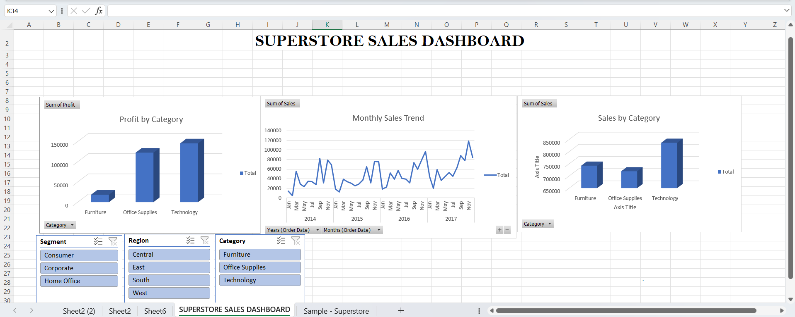

# Superstore Sales Dashboard

## Objective
Created an interactive Excel dashboard to analyze sales performance using the Superstore dataset.

## Tools Used
- Microsoft Excel
- Pivot Tables
- Pivot Charts
- Slicers
- Conditional Formatting

## Dashboard Features
- Sales by Category
- Profit by Category
- Monthly Sales Trend
- Interactive Filters

## Outcome
Analyzed sales and profit trends to identify business performance across categories and time periods.

